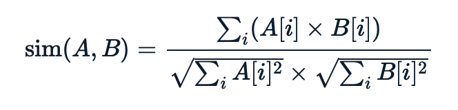
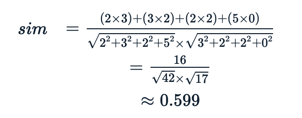

## Lab03 - Exercise - Unmasked (3 points)

In July 2013, J.K. Rowling was [unmasked](https://en.wikipedia.org/wiki/The_Cuckoo%27s_Calling) as the author of the crime novel *The Cuckoo's Calling*, published under the pseudonym "Robert Galbraith". Rowling's identity was revealed due to a combination of factors: an unwitting leak from one of her lawyers to a friend who subsequently tweeted the information, and some basic linguistic analysis comparing the writing style of the book to Rowling's previous work.

One simple indicator of writing style is the distribution of word lengths; that is, how many times words of length 1, 2, 3, etc. appear. In this question, you will write a program to compute the frequency of word lengths in texts, and then use them as a basic indicator of similarity between texts.

Write a function `similarities(texts, unknown)` program in `unmasked.py` where `texts` is a list of names. For each file name, open the file and calculate the frequency of each word length. Words of each line are separated by spaces, and you should strip punctuation at the start and end of each word (see hint). Files are guaranteed to contain at least one word after stripping punctuation.

The function call might look like this:

```python
>>> simiarities('austen.txt','shakespeare.txt')
```

`austen.txt` might look like:

```
It is up a tree over the hill via a lake side.
```

`shakespeare.txt` might look like :

```
We hike to a en tu.
```

For each file name, you should compute lists *of the same size* that look like the following:

```
# 2 words of length 1, 3 words of length 2 ...
[2, 3, 2, 5]

# 1 word of length 1, 4 words of length 2 ...
[1, 4, 0, 1]

# 3 words of length 1, 2 words of length 2 ...
[3, 2, 2, 0]
```

The `unknown` parameter will be the file name of an unknown text, for which you should also calculate the word length frequencies and the resulting list. Then, for each file name in `texts.txt`, you should return a list containing the name of the file with the **cosine similarity** between that file and `unknown`, sorted in descending order of similarity.

The cosine similarity between frequency lists `A` and `B` is a number between `0` and `1`, where `0` indicates no similarity and `1` indicates that `A` and `B` are identical. The value is calculated as follows:



The formula above means that for each possible word length, we take the count for that word length in `A` and the count for that word length in `B`, add up all the products, then divide that by the square root of the sum of the squares of word lengths in `A` and the square root of the sum of the squares of the word lengths in `B`.

For example, the cosine similarity between the first and third lists above is:



If `unknown = 'unknown.txt'` which looks like this:

```
A yo yo, a bee, a sea
```

Then your final output should look like the following:

```
[(0.629, shakespeare.txt),
(0.599, austen.txt)]
```

All numbers should be rounded to three decimal places.

### Hint

To strip punctuation from the start and end of a word, use the following code:

```python
import string
...
word = word.strip(string.punctuation)
```

Problem sourced from Grok Learning NCSS Challenged (Advanced), 2017.
